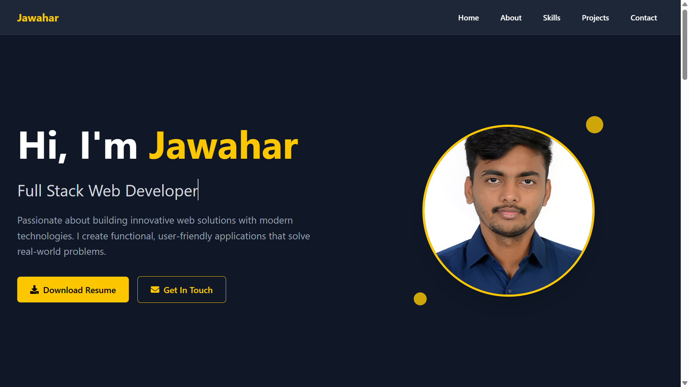

# Jawahar's Portfolio

A modern, responsive portfolio website built with React, Vite, and Tailwind CSS. This project showcases my skills, projects, and contact information as a Full Stack Web Developer specializing in the MERN stack.

## Table of Contents
- [Demo](#demo)
- [Features](#features)
- [Screenshots](#screenshots)
- [Tech Stack](#tech-stack)
- [Getting Started](#getting-started)
- [Project Structure](#project-structure)
- [Customization](#customization)
- [Deployment](#deployment)
- [Contact](#contact)

---

## Demo

Live Demo: [https://jawahar-my-portfolio.netlify.app/](https://jawahar-my-portfolio.netlify.app/)

---

## Features
- **Responsive Design:** Looks great on all devices (desktop, tablet, mobile).
- **Hero Section:** Introduction, resume download, and quick contact.
- **About Section:** Personal background and info.
- **Skills Section:** Visual representation of technical skills (HTML, CSS, JS, React, Node.js, Express, MongoDB, MySQL, Tailwind, Git).
- **Projects Showcase:** List of featured projects with descriptions, tech stack, GitHub links, and live demos.
- **Contact Section:** Email, phone, LinkedIn, and a contact form.
- **Dark Theme:** Modern dark UI with Tailwind CSS.
- **Smooth Navigation:** Scroll-to-section, mobile menu, and scroll-to-top button.

---

## Screenshots



---

## Tech Stack
- **Frontend:** React 19, Tailwind CSS 4
- **Build Tool:** Vite
- **Icons:** react-icons

---

## Getting Started

### Prerequisites
- Node.js (v18 or above recommended)
- npm or yarn

### Installation
1. **Clone the repository:**
   ```bash
   git clone <your-repo-url>
   cd Portfolio
   ```
2. **Install dependencies:**
   ```bash
   npm install
   # or
   yarn install
   ```
3. **Start the development server:**
   ```bash
   npm run dev
   # or
   yarn dev
   ```
4. **Open in browser:**
   Visit [http://localhost:5173](http://localhost:5173) (or the port shown in your terminal).

### Build for Production
```bash
npm run build
# or
yarn build
```
The output will be in the `dist/` folder.

### Preview Production Build
```bash
npm run preview
# or
yarn preview
```

---

## Customization
- **Profile Image:** Replace `public/Jawahar.jpg` with your own photo.
- **Resume:** Replace `/Jawahar Govindasamy Resume.pdf` with your own resume file.
- **Project Data:** Edit the `projects` array in `src/Components/Portfolio.jsx` to add or update your projects.
- **Skills:** Update the `skills` array in `Portfolio.jsx` to reflect your expertise.
- **Contact Info:** Update email, phone, LinkedIn, and GitHub links in `Portfolio.jsx`.
- **Styling:** Modify Tailwind classes in the JSX for further customization.

---

## Deployment
You can deploy this portfolio easily to platforms like Netlify, Vercel, or GitHub Pages.

### Example: Deploy to Netlify
1. Push your code to GitHub.
2. Connect your repository to Netlify.
3. Set the build command to `npm run build` and the publish directory to `dist/`.
4. Deploy!

---

## Contact

- **Email:** jawahargovindasamy19@gmail.com
- **LinkedIn:** [Jawahar Govindasamy](https://www.linkedin.com/in/jawahar-govindasamy-407480236/)
- **GitHub:** [Jawahar Govindasamy](https://github.com/jawahargovindasamy)

---

## Credits
- Built with [React](https://react.dev/) and [Tailwind CSS](https://tailwindcss.com/)
- Icons by [react-icons](https://react-icons.github.io/react-icons/)

---

© 2025 Jawahar. All rights reserved.
